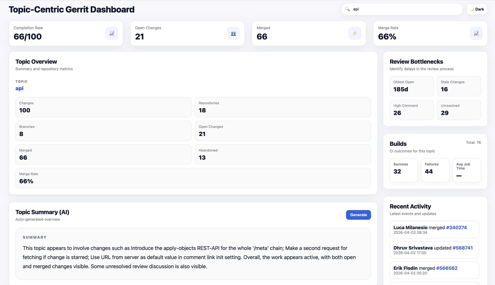
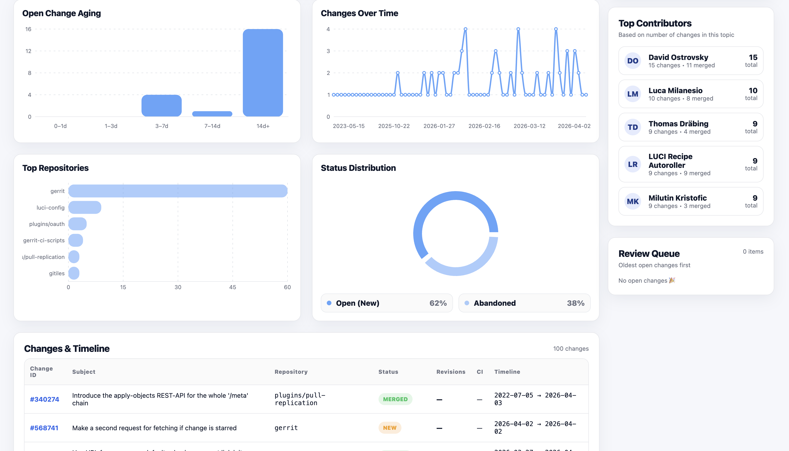

# Topic-Centric Gerrit Dashboard

A full-stack dashboard for analyzing Gerrit topics, visualizing development activity, and generating AI-powered summaries to help users quickly understand code changes.

---

## Features

- Topic analytics, including total changes, merge rate, repositories, and branches
- Contributor insights with top contributor activity
- Review bottleneck detection for stale changes and unresolved comments
- Build status overview using Gerrit CI signals
- Interactive dashboard with a clean, modern UI
- AI-generated topic summaries using a local LLM through Ollama

---

## Screenshots

### Dashboard Overview





---

## Demo

[Watch the demo video](demo/demo.mp4)

---

## Architecture

Frontend (React)  
↓  
Backend (Node.js / Express)  
↓  
Gerrit REST API  
↓  
Ollama (local LLM for summaries)

---

## Tech Stack

- Frontend: React with Vite
- Backend: Node.js with Express
- API: Gerrit REST API
- AI: Ollama
- Styling: Custom CSS with light and dark mode support

---

## How to Run Locally

Make sure you have Node.js and Ollama installed.

### 1. Clone the repository

```bash
git clone https://github.com/neginjanfada/topic-centric-gerrit-dashboard.git
cd topic-centric-gerrit-dashboard
```
### 2. Set up the backend
cd backend
npm install

#### Create a .env file inside the backend folder with:
GERRIT_BASE_URL=https://your-gerrit-instance <br />
GERRIT_USER=your-username <br />
GERRIT_TOKEN=your-token <br />
OLLAMA_MODEL=qwen:0.5b

## Start the backend:
npm run dev

### 3. Set up the frontend
#### Open a new terminal:
cd frontend
npm install
npm run dev

### 4. Run Ollama
#### Make sure Ollama is running with your chosen model:
ollama run qwen:0.5b

### How It Works
	1.	The user enters a Gerrit topic.
	2.	The backend fetches related changes from Gerrit.
	3.	The data is processed into metrics, contributors, bottlenecks, and build insights.
	4.	The AI model generates a short summary of the topic.
	5.	The frontend displays the results in a structured dashboard.

### Example Use Cases
	•	Quickly understand a feature or topic branch
	•	Identify review bottlenecks
	•	Track contributor activity
	•	Summarize large sets of Gerrit changes

### Author
Negin Janfada

### Future Improvements
	•	Smarter AI summaries
	•	Advanced filtering by repository or contributor
	•	Live Gerrit updates
	•	Cloud deployment

